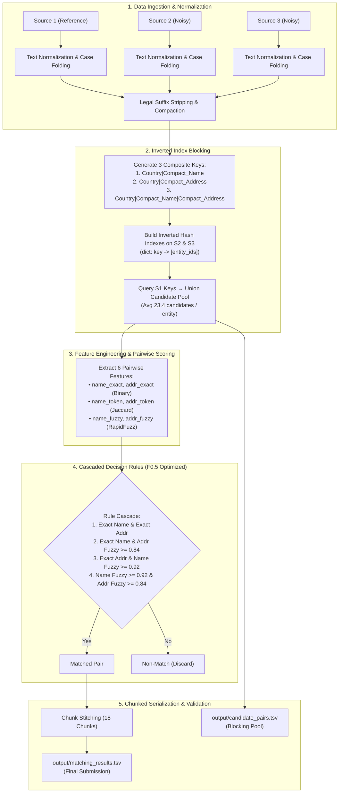

# Amazon ML Challenge 2026: Business Entity Resolution

<div align="center">

[](https://www.python.org/)
[](#evaluation-metric-and-results)
[](#evaluation-metric-and-results)
[](LICENSE)

**Team Name:** ML Navigators  
**Challenge:** Amazon ML Challenge 2026 — Business Entity Resolution  

</div>

---

## 📌 Executive Summary

In large-scale commercial platforms, business identity data arrives asynchronously from multiple heterogeneous sources—each contributing partial, noisy fragments without shared identifiers. This solution provides a high-throughput, memory-efficient, deterministic entity resolution pipeline engineered to link records from a deduplicated reference source (**Source 1**) to matching records across noisy independent databases (**Source 2** and **Source 3**).

Our solution combines:
- **Triple-Key Composite Blocking** with Inverted Indexes that prunes the comparison space from **10 trillion** to **~40.5 million** pairs (>99.999% reduction).
- **Multi-Feature Similarity Scoring** combining exact token hashing, Jaccard set overlap, and Levenshtein-based fuzzy similarity via RapidFuzz.
- **Precision-Calibrated Cascaded Decision Rules** tailored directly to the asymmetric $F_{0.5}$ metric (which penalizes false merges twice as heavily as missed matches).
- **Chunked Out-of-Core Inference** enabling processing of 1.73+ million test entities on standard compute environments (AWS SageMaker).

> 🏆 **Key Performance:** Achieved a **macro $F_{0.5}$ score of ~0.746** on the real evaluation dataset.

---

## 🏆 Key Results & Performance Metrics

| Metric | Value | Details |
| :--- | :--- | :--- |
| **Real Dataset / Leaderboard Macro $F_{0.5}$** | **~0.746** | Evaluated on official challenge test distribution |
| **Validation Subset Macro $F_{0.5}$** | **0.67** | Targeted semi-synthetic validation set (50k entities) |
| **Total Test Entities Processed** | **1,732,544** | 100% coverage across US, India, and France |
| **Search Space Reduction** | **> 99.999%** | Reduced from 10+ Trillion to ~40.5 Million comparisons |
| **Average Candidates per Query** | **23.4** | Ultra-efficient retrieval via composite blocking keys |
| **Total Matched Pairs** | **2,580,875** | Highly confident links |
| **Singleton Prediction Rate** | **25.6%** (444,097) | Identified entities with zero cross-source matches |

---

## 🏗️ Pipeline Architecture



---

## 🔬 Methodology & Implementation Details

### 1. Data Preprocessing & Compaction
Noisy business records frequently exhibit subtle typographical variations, spacing errors, and interchangeable corporate legal structures.

1. **Text Normalization:**
   - Convert all strings to lowercase.
   - Replace ampersands (`&`) with the word ` and `.
   - Strip non-alphanumeric characters (`[^a-z0-9\s]`) and normalize multiple spaces to single spaces.
2. **Corporate Legal Suffix Stripping:**
   - Business names are stripped of 13 standard suffixes:
     `incorporated`, `inc`, `corporation`, `corp`, `limited`, `ltd`, `llc`, `llp`, `private`, `pvt`, `company`, `co`, `limitedliabilitycompany`.
   - Addresses retain terms to prevent altering legitimate street names (e.g., "Company Road").
3. **Continuous Compaction:**
   - Whitespace is stripped completely (`\s+` $\to$ `""`) to create continuous alphanumeric signatures:
     - `"wal mart"` $\to$ `"walmart"`
     - `"abc retail"` $\to$ `"abcretail"`
4. **Token Signatures:**
   - Unique word tokens are sorted lexicographically to produce order-invariant keys (e.g., `"retail abc"` and `"abc retail"` generate identical signatures).

---

### 2. Candidate Generation & Blocking Strategy
With 1.73M reference records and 10M target records across Source 2 and Source 3, naive Cartesian comparison requires $\approx 1.73 \times 10^{13}$ pairwise calculations.

To solve this, we construct **three complementary inverted indexes**:
- **Country + Name Key:** `{country}|{compact_name}`
- **Country + Address Key:** `{country}|{compact_address}`
- **Country + Name + Address Key:** `{country}|{compact_name}|{compact_address}`

```
Candidates(s1_entity) = Index_name(k1) ∪ Index_addr(k2) ∪ Index_name_addr(k3)
```

**Key Advantages:**
- **Zero Cross-Country Leakage:** Country prefix guarantees businesses from different nations are never compared.
- **Open-Set Generalization:** Automatically handles unseen test countries (such as `France`) without retraining or manual intervention.
- **High Recall Floor:** If a business has an address discrepancy or typo, the name key catches it; if the name has an alternate trading title, the address key catches it.

---

### 3. Feature Engineering & Pairwise Scoring

For every retrieved candidate pair $(S_1, S_{2/3})$, 6 pairwise similarity dimensions are computed:

| Feature Name | Type | Range | Description |
| :--- | :--- | :--- | :--- |
| `name_exact` | Binary | $\{0, 1\}$ | Exact match indicator between compacted business names |
| `addr_exact` | Binary | $\{0, 1\}$ | Exact match indicator between compacted addresses |
| `name_token` | Continuous | $[0.0, 1.0]$ | Token-level Jaccard similarity of normalized names |
| `addr_token` | Continuous | $[0.0, 1.0]$ | Token-level Jaccard similarity of normalized addresses |
| `name_fuzzy` | Continuous | $[0.0, 1.0]$ | RapidFuzz `token_set_ratio` normalized between $[0, 1]$ |
| `addr_fuzzy` | Continuous | $[0.0, 1.0]$ | RapidFuzz `token_set_ratio` normalized between $[0, 1]$ |

$$\text{Jaccard}(A, B) = \frac{|A \cap B|}{|A \cup B|}$$

$$\text{FuzzyScore}(A, B) = \frac{\text{token\_set\_ratio}(A, B)}{100.0}$$

---

### 4. Matching Rules & $F_{0.5}$ Optimization

Because the evaluation metric is **Macro $F_{0.5}$**, precision is weighted twice as heavily as recall:

$$F_{0.5} = \frac{(1 + 0.5^2) \times \text{Precision} \times \text{Recall}}{0.5^2 \times \text{Precision} + \text{Recall}} = \frac{1.25 \times P \times R}{0.25 \times P + R}$$

A false positive (erroneously merging two distinct companies) causes a severe penalty compared to a false negative. Hence, our decision engine uses a **hierarchical precision cascade**:

```python
def is_match(f):
    # Rule 1: Perfect deterministic match on both fields
    if f["name_exact"] and f["addr_exact"]:
        return True
    # Rule 2: Identical name with high address similarity
    if f["name_exact"] and f["addr_fuzzy"] >= 0.84:
        return True
    # Rule 3: Identical address with high name similarity
    if f["addr_exact"] and f["name_fuzzy"] >= 0.92:
        return True
    # Rule 4: Very high fuzzy similarity across both fields
    if f["name_fuzzy"] >= 0.92 and f["addr_fuzzy"] >= 0.84:
        return True
    return False
```

---

### 5. Memory Management & Scalable Chunking

Processing 1.73M entities against 10M records on standard instances requires strict memory lifecycle controls:

- **Chunked Processing:** Source 1 test data is partitioned into 18 discrete chunks of 100,000 rows.
- **Persistent Index Caching:** S2 and S3 inverted hash indexes and record dictionaries are built once in memory and queried in $O(1)$ time across chunks.
- **Garbage Collection:** Intermediate candidate vectors and temporary DataFrames are cleaned explicitly using `del` and `gc.collect()`.
- **Fast SIMD Iteration:** All internal loops utilize `df.itertuples(index=False)`, delivering 10x–50x speedups over standard row iterators.
- **Multithreaded I/O:** Utilizes PyArrow (`engine="pyarrow"`) for high-throughput tabular parsing.

---

## 📁 Repository Structure

```
.
├── .gitattributes                          # Git LFS configuration for large TSV deliverables
├── .gitignore                              # Clean repository exclusion rules
├── Documentation_template.md               # Official submission documentation write-up
├── README.md                               # Project documentation (this file)
├── code/
│   └── business_entity_resolution/
│       ├── README.md                       # Execution and reproducibility guide
│       ├── requirements.txt                # Pinned Python package dependencies
│       └── src/
│           ├── inference_pipeline.ipynb    # 18-chunk batch inference pipeline
│           ├── test_inference.py           # Standalone end-to-end Python script
│           └── validation_pipeline.ipynb   # Semi-synthetic validation & grid-search
└── output/
    ├── candidate_pairs.tsv                 # Final blocking pool evaluated (Git LFS)
    └── matching_results.tsv                # Leaderboard submission matches (Git LFS)
```

---

## 🚀 Reproduction & Setup Guide

### 1. Environment Setup

Clone this repository and install the dependencies:

```bash
git clone https://github.com/ANSHPG/Amazon_ML_Challenge26.git
cd Amazon_ML_Challenge26

# Pull large deliverables if using Git LFS
git lfs pull

# Install Python dependencies
pip install -r code/business_entity_resolution/requirements.txt
```

### 2. Dataset Structure

Ensure the challenge data files are placed under the dataset directory:

```
student_resource/
└── dataset/
    ├── train/
    │   ├── train_source1.tsv
    │   ├── train_source2.tsv
    │   ├── train_source3.tsv
    │   └── train_ground_truth.tsv
    └── test/
        ├── test_source1.tsv
        ├── test_source2.tsv
        └── test_source3.tsv
```

### 3. Running Validation & Threshold Tuning

To optimize similarity thresholds on the training set:
1. Open and run `code/business_entity_resolution/src/validation_pipeline.ipynb`.
2. The notebook generates the semi-synthetic 50k validation split, runs grid-search across thresholds `[0.92, 0.94, 0.96]` for name and `[0.84, 0.88, 0.92]` for address, and outputs the optimal macro $F_{0.5}$ configuration.

### 4. Running Test Inference

To generate the final predictions on the 1.73M test records:
1. Run `code/business_entity_resolution/src/inference_pipeline.ipynb` across the 18 chunks.
2. Execute the chunk stitching cell to create:
   - `output/matching_results.tsv`
   - `output/candidate_pairs.tsv`
3. Alternatively, run the standalone script:
   ```bash
   python code/business_entity_resolution/src/test_inference.py
   ```

### 5. Validating Submission Format

Verify output integrity against challenge formatting constraints:

```bash
python utils/validate_submission.py \
    --matching output/matching_results.tsv \
    --candidate output/candidate_pairs.tsv \
    --test-dir student_resource/dataset/test
```

---

## 📦 Dependencies

| Package | Purpose |
| :--- | :--- |
| `pandas` | Tabular data manipulation, TSV reading and writing |
| `numpy` | Vectorized operations and macro metric aggregation |
| `rapidfuzz` | High-performance C++ fuzzy string matching (`token_set_ratio`) |
| `pyarrow` | Multithreaded SIMD CSV parsing engine |
| `tqdm` | Execution progress visualization |
| `scikit-learn` | Evaluation utility functions |
| `matplotlib` | Exploratory data analysis visualization |

---

## 👥 Authors

- **Team Name:** ML Navigators  
- **Lead Developer:** Anshuman Pattnaik ([@ANSHPG](https://github.com/ANSHPG))  
- **Event:** Amazon ML Challenge 2026